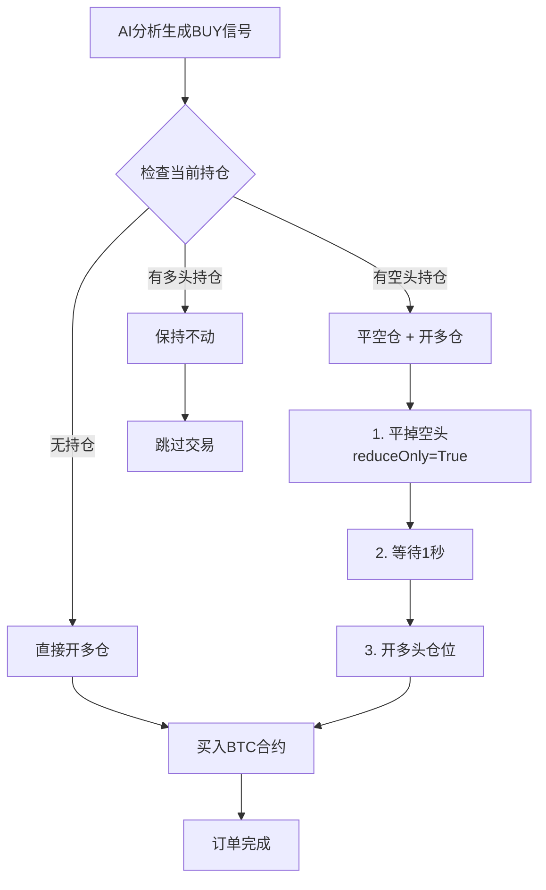
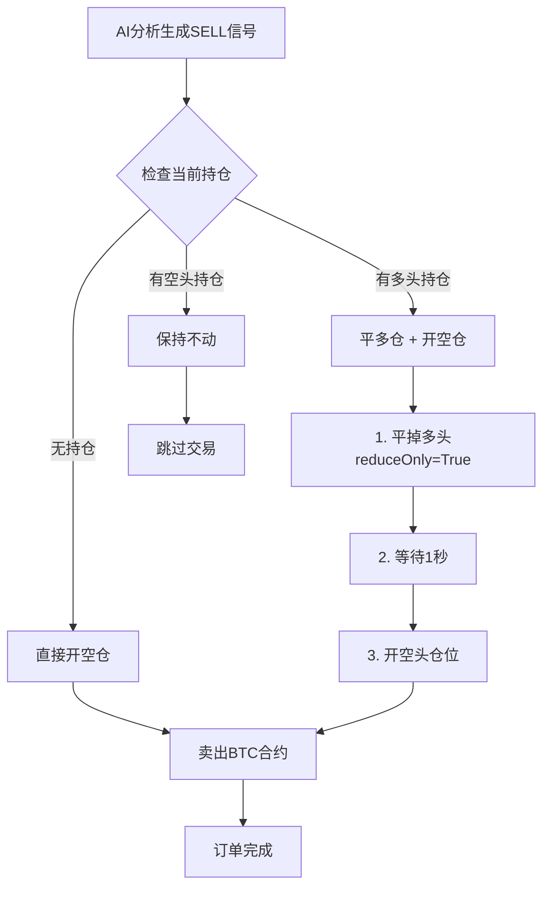
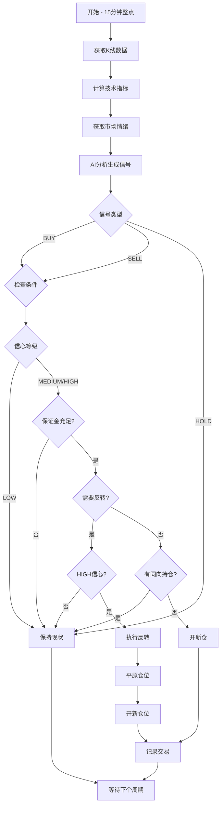

# BTC/USDT 自动交易机器人 - 买卖机制详解

## 📌 项目概述

本项目是一个基于AI分析的BTC/USDT永续合约自动交易机器人，通过技术指标分析和市场情绪分析来生成交易信号。

### 核心特性
- **AI驱动**：使用DeepSeek/Qwen大模型分析市场
- **技术分析**：融合均线、RSI、MACD、布林带等多种指标
- **情绪分析**：整合CryptoOracle市场情绪数据
- **自动交易**：15分钟周期自动执行
- **风险控制**：多重安全机制防止过度交易和爆仓

---

## 💰 资金计算方式

### USDT金额计算模式

```
投入保证金 × 杠杆倍数 = 实际开仓金额
```

**示例配置**（当前默认）：
```python
TRADE_CONFIG = {
    'margin_usdt': 120,      # 每次投入120 USDT保证金
    'leverage': 10,          # 10倍杠杆
    'position_usdt': 1200,   # 实际开仓1200 USDT（自动计算）
}
```

**实际买入数量**：
```
BTC数量 = 开仓金额 / 当前BTC价格
```

当BTC价格 = 100,000 USDT时：
- 买入数量 = 1200 / 100,000 = 0.012 BTC

**自动调整机制**：
- OKX最小订单量：0.01 BTC
- 如果计算数量 < 0.01 BTC，自动调整为 0.01 BTC
- 相应调整所需保证金

---

## 🟢 多头（做多）买卖机制

### 📈 开多仓条件

AI生成 **BUY** 信号时触发，需满足：
1. ✅ 技术指标显示上涨趋势
2. ✅ 信心等级 ≥ MEDIUM（中高信心）
3. ✅ 保证金充足（< 80%可用余额）

### 多头交易流程



### 多头执行示例

**场景1：无持仓开多**
```python
# 当前状态：无持仓
# AI信号：BUY (HIGH信心)
# 执行操作：
exchange.create_market_order(
    'BTC/USDT:USDT',  # 交易对
    'buy',             # 买入
    1,                 # 1张 = 0.01 BTC
    params={
        'tdMode': 'cross',  # 全仓模式
    }
)
# 结果：持有0.01 BTC多头仓位
```

**场景2：空头反转多头**
```python
# 当前状态：持有0.01 BTC空头
# AI信号：BUY (HIGH信心)
# 执行操作：
# 步骤1：平空仓
exchange.create_market_order('BTC/USDT:USDT', 'buy', 0.01, 
                            params={'reduceOnly': True})
# 步骤2：开多仓
exchange.create_market_order('BTC/USDT:USDT', 'buy', 0.01)
# 结果：持有0.01 BTC多头仓位
```

### 多头持仓管理

| 情况 | 操作 | 说明 |
|------|------|------|
| 连续BUY信号 | 保持持仓 | 避免重复开仓 |
| 出现HOLD信号 | 保持持仓 | 等待明确方向 |
| 出现SELL信号（HIGH） | 平多开空 | 趋势反转 |
| 出现SELL信号（LOW/MEDIUM） | 保持持仓 | 非高信心不反转 |

---

## 🔴 空头（做空）买卖机制

### 📉 开空仓条件

AI生成 **SELL** 信号时触发，需满足：
1. ✅ 技术指标显示下跌趋势
2. ✅ 信心等级 ≥ MEDIUM（中高信心）
3. ✅ 保证金充足（< 80%可用余额）

### 空头交易流程



### 空头执行示例

**场景1：无持仓开空**
```python
# 当前状态：无持仓
# AI信号：SELL (HIGH信心)
# 执行操作：
exchange.create_market_order(
    'BTC/USDT:USDT',  # 交易对
    'sell',            # 卖出
    1,                 # 1张 = 0.01 BTC
    params={
        'tdMode': 'cross',  # 全仓模式
    }
)
# 结果：持有0.01 BTC空头仓位
```

**场景2：多头反转空头**
```python
# 当前状态：持有0.01 BTC多头
# AI信号：SELL (HIGH信心)
# 执行操作：
# 步骤1：平多仓
exchange.create_market_order('BTC/USDT:USDT', 'sell', 0.01, 
                            params={'reduceOnly': True})
# 步骤2：开空仓
exchange.create_market_order('BTC/USDT:USDT', 'sell', 0.01)
# 结果：持有0.01 BTC空头仓位
```

### 空头持仓管理

| 情况 | 操作 | 说明 |
|------|------|------|
| 连续SELL信号 | 保持持仓 | 避免重复开仓 |
| 出现HOLD信号 | 保持持仓 | 等待明确方向 |
| 出现BUY信号（HIGH） | 平空开多 | 趋势反转 |
| 出现BUY信号（LOW/MEDIUM） | 保持持仓 | 非高信心不反转 |

---

## 🛡️ 风险控制机制

### 1️⃣ 防频繁反转

**规则**：
- ✅ 方向反转必须是 **HIGH信心** 信号
- ✅ 近期信号历史中不能有重复
- ✅ 避免在短时间内多次反转

**代码逻辑**：
```python
if new_side != current_side:
    # 必须高信心
    if signal_data['confidence'] != 'HIGH':
        print("🔒 非高信心反转信号，保持现有仓位")
        return
    
    # 检查历史信号
    if len(signal_history) >= 2:
        last_signals = [s['signal'] for s in signal_history[-2:]]
        if signal_data['signal'] in last_signals:
            print("🔒 近期已出现信号，避免频繁反转")
            return
```

### 2️⃣ 保证金检查

**规则**：
- 所需保证金 ≤ 80%可用余额
- 保留20%作为安全垫

**计算示例**：
```
可用余额：500 USDT
最大可用：500 × 80% = 400 USDT
配置保证金：120 USDT ✅ 通过
```

### 3️⃣ 信心等级过滤

**三级信心体系**：

| 信心等级 | 交易策略 | 触发条件 |
|---------|---------|---------|
| **HIGH** | 立即执行（包括反转） | 多指标强烈同向 |
| **MEDIUM** | 同向执行，不反转 | 指标基本同向 |
| **LOW** | 跳过执行 | 信号不明确 |

**代码实现**：
```python
# 低信心不执行
if signal_data['confidence'] == 'LOW':
    print("⚠️ 低信心信号，跳过执行")
    return
```

### 4️⃣ 自动订单调整

**最小订单量限制**：
- OKX永续合约最小：0.01 BTC
- 自动调整到最小值并重新计算保证金

```python
MIN_ORDER_SIZE = 0.01
if btc_amount < MIN_ORDER_SIZE:
    btc_amount = MIN_ORDER_SIZE
    actual_position_usdt = btc_amount * current_price
    actual_margin_usdt = actual_position_usdt / leverage
    print(f"⚠️ 自动调整为最小订单量：{MIN_ORDER_SIZE} BTC")
```

---

## 📊 完整交易决策流程



---

## ⚙️ 配置参数说明

### 交易配置

```python
TRADE_CONFIG = {
    'symbol': 'BTC/USDT:USDT',  # 交易对
    'margin_usdt': 120,          # 🔧 每次投入保证金(USDT)
    'leverage': 10,              # 🔧 杠杆倍数
    'timeframe': '15m',          # K线周期
    'test_mode': False,          # 🔧 测试模式开关
    'data_points': 96,           # 分析数据点（24小时）
}
```

### 建议配置方案

| 风险偏好 | 保证金 | 杠杆 | 单次开仓 | 适合资金 |
|---------|--------|------|---------|---------|
| 保守型 | 50 USDT | 5x | 250 USDT | 500+ USDT |
| 稳健型 | 120 USDT | 10x | 1200 USDT | 1000+ USDT |
| 激进型 | 500 USDT | 20x | 10000 USDT | 5000+ USDT |

---

## 📈 AI决策依据

### 技术指标权重

```
1. 趋势判断（均线排列）  → 权重 40%
2. RSI超买超卖          → 权重 20%
3. MACD动量方向         → 权重 20%
4. 布林带位置           → 权重 10%
5. 支撑阻力位           → 权重 10%
```

### 市场情绪整合

```
- 技术分析 60% + 市场情绪 30% + 风险管理 10%
- 情绪与技术同向 → 增强信号信心
- 情绪与技术背离 → 以技术分析为主
```

### 信号生成逻辑

**BUY信号条件**（满足3项及以上）：
- ✅ 价格 > SMA20 且 SMA20 > SMA50（多头排列）
- ✅ RSI < 70（非超买）
- ✅ MACD > 信号线（金叉）
- ✅ 布林带位置 < 0.7（未到上轨）
- ✅ 市场情绪偏乐观（正净值）

**SELL信号条件**（满足3项及以上）：
- ✅ 价格 < SMA20 且 SMA20 < SMA50（空头排列）
- ✅ RSI > 30（非超卖）
- ✅ MACD < 信号线（死叉）
- ✅ 布林带位置 > 0.3（未到下轨）
- ✅ 市场情绪偏悲观（负净值）

**HOLD信号**：
- 指标不明确或震荡市

---

## 🚨 重要注意事项

### ⚠️ 风险提示

1. **杠杆风险**：10倍杠杆下，价格波动10%即可能爆仓
2. **滑点风险**：市价单可能存在滑点
3. **API风险**：网络延迟或API故障可能影响交易
4. **AI误判**：模型分析不保证100%准确

### 💡 使用建议

1. **小额测试**：先用最小金额测试（50-100 USDT）
2. **监控运行**：前期密切关注交易执行情况
3. **设置告警**：配置余额不足、亏损过大的告警
4. **定期检查**：每天检查持仓和盈亏情况
5. **止损止盈**：虽然AI会给出建议，但需手动设置止损

### 🔧 故障排查

**常见问题**：

| 问题 | 原因 | 解决方案 |
|-----|------|---------|
| 订单失败 | 保证金不足 | 增加账户余额或降低保证金配置 |
| 频繁HOLD信号 | 市场震荡 | 正常现象，等待趋势明确 |
| AI连接失败 | API密钥或网络问题 | 检查.env配置和网络 |
| 订单数量错误 | 低于最小限制 | 已自动调整至0.01 BTC |

---

## 📝 交易日志示例

### 典型多头交易
```
[2025-01-20 09:00:00] 执行周期开始
- 当前价格: $98,500
- 技术分析: 强势上涨（SMA多头排列，RSI 58）
- 市场情绪: 乐观 +0.045
- AI决策: BUY (HIGH信心)
- 执行操作: 无持仓 → 开多仓
- 下单详情: 买入 0.01 BTC @ $98,500
- 保证金: 98.5 USDT (10x杠杆)
- 止盈目标: $100,350 (+1.88%)
- 止损价格: $97,030 (-1.49%)
```

### 典型空头交易
```
[2025-01-20 12:00:00] 执行周期开始
- 当前价格: $102,300
- 技术分析: 强势下跌（死叉，RSI 71超买）
- 市场情绪: 悲观 -0.032
- AI决策: SELL (HIGH信心)
- 执行操作: 有多头持仓 → 平多开空
- 平仓盈亏: +38.50 USDT (+3.85%)
- 下单详情: 卖出 0.01 BTC @ $102,300
- 保证金: 102.3 USDT (10x杠杆)
- 止盈目标: $100,254 (-2.00%)
- 止损价格: $103,323 (+1.00%)
```

---

## 📚 相关文件

- `deepseekok2.py` - 主交易程序
- `test_order.py` - 订单测试脚本
- `web_server.py` - Web监控界面
- `.env` - API密钥配置
- `requirements.txt` - 依赖包列表

---

## 🔗 快速开始

```bash
# 1. 安装依赖
pip install -r requirements.txt

# 2. 配置API密钥（编辑.env文件）
OKX_API_KEY=your_api_key
OKX_SECRET=your_secret
OKX_PASSWORD=your_password
DEEPSEEK_API_KEY=your_deepseek_key

# 3. 测试订单（建议先测试）
python test_order.py

# 4. 启动交易机器人
python deepseekok2.py

# 5. 启动Web监控（可选）
python web_server.py
```

---

## 📞 支持与反馈

如有问题或建议，请查看代码注释或联系开发者。

**最后更新**: 2025-01-20
**版本**: v2.0
**许可**: MIT License

